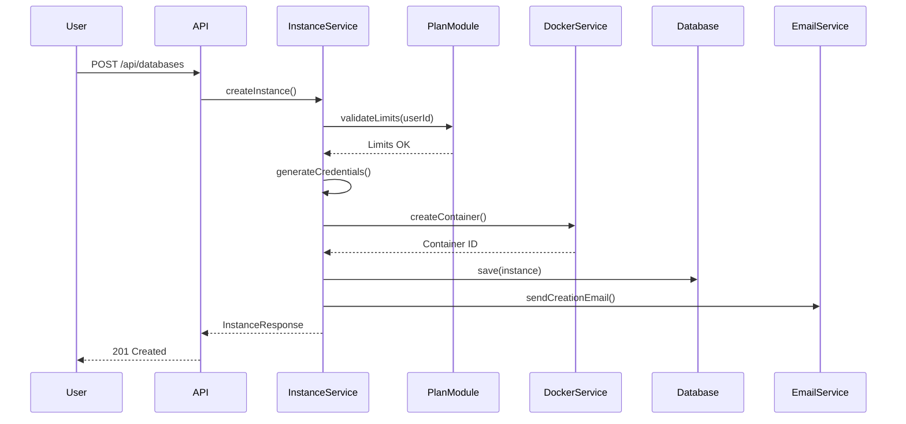

# Arquitectura del Sistema

## Visión General

CrudCloud Backend adopta una **arquitectura de monolito modular** diseñada para evolucionar a microservicios en el futuro. Esta decisión arquitectónica permite un desarrollo rápido del MVP mientras mantiene la estructura necesaria para una transición suave a microservicios.

## Decisión Arquitectónica (ADR-000)

### Contexto

CrudCloud necesita escalar eventualmente a múltiples microservicios independientes. Sin embargo, para reducir la complejidad del MVP y minimizar riesgos, adoptamos un enfoque de monolito modular en Fase 1 que transiciona naturalmente a microservicios en Fase 2.

### Fases

#### Fase 1: Monolito Modular (MVP)
- Un único JAR desplegable
- Módulos verticales con límites claros
- Comunicación mediante eventos e interfaces
- Base de datos compartida con ownership lógico

#### Fase 2: Microservicios (Escalamiento)
- Servicios independientes por módulo
- API Gateway para routing
- Base de datos por servicio
- Comunicación mediante HTTP/REST y mensajería

## Módulos del Sistema

### 1. Auth Module
**Responsabilidad:** Autenticación, registro y gestión de usuarios

- Registro de usuarios (individuales y organizaciones)
- Login con JWT
- Gestión de perfiles
- OAuth2 (preparado para futuro)

**Endpoints:**
- `POST /api/auth/register`
- `POST /api/auth/login`
- `GET /api/auth/profile`

### 2. Instance Module
**Responsabilidad:** Provisioning y lifecycle de instancias de bases de datos

- Creación de contenedores Docker
- Gestión de estados (CREATING, RUNNING, SUSPENDED, DELETED)
- Rotación de credenciales
- Generación de PDFs

**Endpoints:**
- `POST /api/databases`
- `GET /api/databases`
- `GET /api/databases/{id}`
- `PUT /api/databases/{id}/suspend`
- `PUT /api/databases/{id}/resume`
- `DELETE /api/databases/{id}`
- `POST /api/databases/{id}/rotate-password`

### 3. Payment Module
**Responsabilidad:** Procesamiento de pagos y transacciones

- Integración con Mercado Pago
- Webhooks de pago
- Trazabilidad de transacciones
- Actualización de planes

**Endpoints:**
- `POST /api/payments/create-preference`
- `POST /api/payments/webhook`
- `GET /api/payments/transactions`

### 4. Plan Module
**Responsabilidad:** Gestión de planes y límites

- Definición de planes (FREE, STANDARD, PREMIUM)
- Validación de límites
- Upgrade/downgrade de planes

**Endpoints:**
- `GET /api/plans`
- `GET /api/plans/current`
- `POST /api/plans/upgrade`

### 5. Catalog Module
**Responsabilidad:** Catálogo de motores de bases de datos

- Listado de motores disponibles
- Especificaciones técnicas
- Configuraciones por defecto

**Endpoints:**
- `GET /api/engines`
- `GET /api/engines/{engine}`

### 6. Core Module
**Responsabilidad:** Infraestructura compartida

- Configuración global
- Manejo de excepciones
- Eventos del sistema
- Utilities

## Comunicación Entre Módulos

### ✅ Preferido: Event-Driven (para notificaciones/reacciones)

```java
// Publicar evento
eventPublisher.publishEvent(new InstanceCreatedEvent(instanceId, userId));

// Escuchar evento
@EventListener
public void onInstanceCreated(InstanceCreatedEvent event) {
    // Reaccionar al evento
    emailService.sendInstanceCreatedEmail(event.getUserId());
}
```

### ✅ Permitido: Module API (para consultas/validación)

```java
// Interface del módulo
public interface PaymentModuleApi {
    boolean canUserCreateInstance(Long userId);
    PlanDto getUserPlan(Long userId);
}

// Uso desde otro módulo
@Autowired
private PaymentModuleApi paymentApi;

if (!paymentApi.canUserCreateInstance(userId)) {
    throw new PlanLimitException();
}
```

### ❌ Prohibido: Inyección Directa de Servicios

```java
// ❌ NUNCA hacer esto
@Service
public class InstanceService {
    @Autowired
    private PaymentService paymentService; // ¡Viola límites!
}
```

## Modelo de Datos

### Esquema Principal

```sql
-- Usuarios
CREATE TABLE users (
    id BIGSERIAL PRIMARY KEY,
    email VARCHAR(255) UNIQUE NOT NULL,
    password VARCHAR(255) NOT NULL,
    name VARCHAR(255) NOT NULL,
    user_type VARCHAR(50) NOT NULL,
    organization_id BIGINT,
    plan_id BIGINT NOT NULL,
    created_at TIMESTAMP DEFAULT CURRENT_TIMESTAMP,
    updated_at TIMESTAMP DEFAULT CURRENT_TIMESTAMP
);

-- Planes
CREATE TABLE plans (
    id BIGSERIAL PRIMARY KEY,
    name VARCHAR(50) UNIQUE NOT NULL,
    max_instances INTEGER NOT NULL,
    price DECIMAL(10,2) NOT NULL,
    currency VARCHAR(3) DEFAULT 'USD'
);

-- Instancias
CREATE TABLE instances (
    id BIGSERIAL PRIMARY KEY,
    user_id BIGINT NOT NULL,
    engine VARCHAR(50) NOT NULL,
    database_name VARCHAR(255) NOT NULL,
    container_id VARCHAR(255),
    host VARCHAR(255) NOT NULL,
    port INTEGER NOT NULL,
    username VARCHAR(255) NOT NULL,
    password_hash VARCHAR(255) NOT NULL,
    status VARCHAR(50) NOT NULL,
    created_at TIMESTAMP DEFAULT CURRENT_TIMESTAMP,
    updated_at TIMESTAMP DEFAULT CURRENT_TIMESTAMP,
    FOREIGN KEY (user_id) REFERENCES users(id)
);

-- Transacciones
CREATE TABLE transactions (
    id BIGSERIAL PRIMARY KEY,
    user_id BIGINT NOT NULL,
    mercadopago_id VARCHAR(255),
    amount DECIMAL(10,2) NOT NULL,
    status VARCHAR(50) NOT NULL,
    plan_id BIGINT NOT NULL,
    created_at TIMESTAMP DEFAULT CURRENT_TIMESTAMP,
    FOREIGN KEY (user_id) REFERENCES users(id),
    FOREIGN KEY (plan_id) REFERENCES plans(id)
);
```

## Flujo de Creación de Instancia



## Seguridad

### Autenticación JWT

```java
@Configuration
@EnableWebSecurity
public class SecurityConfig {
    
    @Bean
    public SecurityFilterChain filterChain(HttpSecurity http) {
        return http
            .csrf(csrf -> csrf.disable())
            .authorizeHttpRequests(auth -> auth
                .requestMatchers("/api/auth/**").permitAll()
                .anyRequest().authenticated()
            )
            .sessionManagement(session -> 
                session.sessionCreationPolicy(SessionCreationPolicy.STATELESS)
            )
            .addFilterBefore(jwtAuthFilter, UsernamePasswordAuthenticationFilter.class)
            .build();
    }
}
```

### Gestión de Credenciales

- **Contraseñas de usuario:** BCrypt con salt
- **Contraseñas de BD:** Generadas aleatoriamente (16 caracteres)
- **Visibilidad única:** Solo en respuesta de creación/rotación
- **Almacenamiento:** Hash en base de datos

## Manejo de Errores

### Jerarquía de Excepciones

```java
public class CrudCloudException extends RuntimeException {}

public class PlanLimitException extends CrudCloudException {}
public class InstanceNotFoundException extends CrudCloudException {}
public class DockerException extends CrudCloudException {}
public class PaymentException extends CrudCloudException {}
```

### Global Exception Handler

```java
@RestControllerAdvice
public class GlobalExceptionHandler {
    
    @ExceptionHandler(PlanLimitException.class)
    public ResponseEntity<ErrorResponse> handlePlanLimit(PlanLimitException ex) {
        return ResponseEntity
            .status(HttpStatus.FORBIDDEN)
            .body(new ErrorResponse("PLAN_LIMIT_REACHED", ex.getMessage()));
    }
}
```

## Configuración por Ambientes

### Development
```properties
spring.profiles.active=dev
logging.level.com.riwi.CrudCloud=DEBUG
spring.jpa.show-sql=true
```

### Production
```properties
spring.profiles.active=prod
logging.level.com.riwi.CrudCloud=INFO
spring.jpa.show-sql=false
```

## Monitoreo y Observabilidad

### Actuator Endpoints

```properties
management.endpoints.web.exposure.include=health,info,metrics
management.endpoint.health.show-details=always
```

### Logging Estructurado

```java
@Slf4j
@Service
public class InstanceService {
    public Instance createInstance(CreateInstanceRequest request) {
        log.info("Creating instance for user: {}, engine: {}", 
            request.getUserId(), request.getEngine());
        // ...
    }
}
```

## Preparación para Microservicios

### Estrategias de Migración

1. **Extracción de Servicios:** Cada módulo se convierte en un repositorio independiente
2. **Base de Datos por Servicio:** Migración de esquemas a bases de datos separadas
3. **API Gateway:** Spring Cloud Gateway para routing centralizado
4. **Service Discovery:** Eureka o Consul
5. **Mensajería:** RabbitMQ o Kafka para eventos
6. **Distributed Tracing:** Jaeger o Zipkin

## Próximos Pasos

- [Referencia de API](./api-reference.md)
- [Deployment](./deployment.md)
