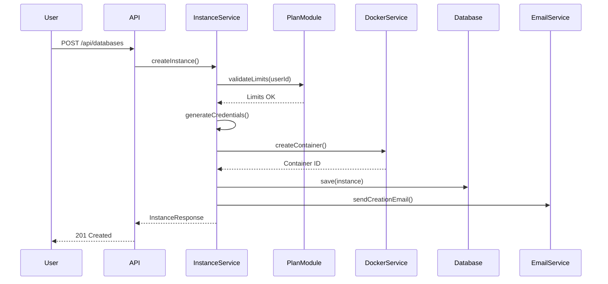

# System Architecture

## Overview

CrudCloud Backend adopts a **modular monolith architecture** designed to evolve into microservices in the future. This architectural decision allows for rapid MVP development while maintaining the necessary structure for a smooth transition to microservices.

## Architectural Decision (ADR-000)

### Context

CrudCloud needs to eventually scale to multiple independent microservices. However, to reduce MVP complexity and minimize risks, we adopt a modular monolith approach in Phase 1 that naturally transitions to microservices in Phase 2.

### Phases

#### Phase 1: Modular Monolith (MVP)
- A single deployable JAR
- Vertical modules with clear boundaries
- Communication via events and interfaces
- Shared database with logical ownership

#### Phase 2: Microservices (Scaling)
- Independent services per module
- API Gateway for routing
- Database per service
- Communication via HTTP/REST and messaging

## System Modules

### 1. Auth Module
**Responsibility:** Authentication, registration, and user management

- User registration (individuals and organizations)
- Login with JWT
- Profile management
- OAuth2 (prepared for future)

**Endpoints:**
- `POST /api/auth/register`
- `POST /api/auth/login`
- `GET /api/auth/profile`

### 2. Instance Module
**Responsibility:** Provisioning and lifecycle of database instances

- Creation of Docker containers
- State management (CREATING, RUNNING, SUSPENDED, DELETED)
- Credential rotation
- PDF generation

**Endpoints:**
- `POST /api/databases`
- `GET /api/databases`
- `GET /api/databases/{id}`
- `PUT /api/databases/{id}/suspend`
- `PUT /api/databases/{id}/resume`
- `DELETE /api/databases/{id}`
- `POST /api/databases/{id}/rotate-password`

### 3. Payment Module
**Responsibility:** Payment processing and transactions

- Mercado Pago integration
- Payment webhooks
- Transaction traceability
- Plan updates

**Endpoints:**
- `POST /api/payments/create-preference`
- `POST /api/payments/webhook`
- `GET /api/payments/transactions`

### 4. Plan Module
**Responsibility:** Plan and limits management

- Plan definition (FREE, STANDARD, PREMIUM)
- Limit validation
- Plan upgrade/downgrade

**Endpoints:**
- `GET /api/plans`
- `GET /api/plans/current`
- `POST /api/plans/upgrade`

### 5. Catalog Module
**Responsibility:** Database engine catalog

- Listing of available engines
- Technical specifications
- Default configurations

**Endpoints:**
- `GET /api/engines`
- `GET /api/engines/{engine}`

### 6. Core Module
**Responsibility:** Shared infrastructure

- Global configuration
- Exception handling
- System events
- Utilities

## Inter-Module Communication

### ✅ Preferred: Event-Driven (for notifications/reactions)

```java
// Publish event
eventPublisher.publishEvent(new InstanceCreatedEvent(instanceId, userId));

// Listen to event
@EventListener
public void onInstanceCreated(InstanceCreatedEvent event) {
    // React to event
    emailService.sendInstanceCreatedEmail(event.getUserId());
}
```

### ✅ Allowed: Module API (for queries/validation)

```java
// Module interface
public interface PaymentModuleApi {
    boolean canUserCreateInstance(Long userId);
    PlanDto getUserPlan(Long userId);
}

// Usage from another module
@Autowired
private PaymentModuleApi paymentApi;

if (!paymentApi.canUserCreateInstance(userId)) {
    throw new PlanLimitException();
}
```

### ❌ Forbidden: Direct Service Injection

```java
// ❌ NEVER do this
@Service
public class InstanceService {
    @Autowired
    private PaymentService paymentService; // Violates boundaries!
}
```

## Data Model

### Main Schema

```sql
-- Users
CREATE TABLE users (
    id BIGSERIAL PRIMARY KEY,
    email VARCHAR(255) UNIQUE NOT NULL,
    password VARCHAR(255) NOT NULL,
    name VARCHAR(255) NOT NULL,
    user_type VARCHAR(50) NOT NULL,
    organization_id BIGINT,
    plan_id BIGINT NOT NULL,
    created_at TIMESTAMP DEFAULT CURRENT_TIMESTAMP,
    updated_at TIMESTAMP DEFAULT CURRENT_TIMESTAMP
);

-- Plans
CREATE TABLE plans (
    id BIGSERIAL PRIMARY KEY,
    name VARCHAR(50) UNIQUE NOT NULL,
    max_instances INTEGER NOT NULL,
    price DECIMAL(10,2) NOT NULL,
    currency VARCHAR(3) DEFAULT 'USD'
);

-- Instances
CREATE TABLE instances (
    id BIGSERIAL PRIMARY KEY,
    user_id BIGINT NOT NULL,
    engine VARCHAR(50) NOT NULL,
    database_name VARCHAR(255) NOT NULL,
    container_id VARCHAR(255),
    host VARCHAR(255) NOT NULL,
    port INTEGER NOT NULL,
    username VARCHAR(255) NOT NULL,
    password_hash VARCHAR(255) NOT NULL,
    status VARCHAR(50) NOT NULL,
    created_at TIMESTAMP DEFAULT CURRENT_TIMESTAMP,
    updated_at TIMESTAMP DEFAULT CURRENT_TIMESTAMP,
    FOREIGN KEY (user_id) REFERENCES users(id)
);

-- Transactions
CREATE TABLE transactions (
    id BIGSERIAL PRIMARY KEY,
    user_id BIGINT NOT NULL,
    mercadopago_id VARCHAR(255),
    amount DECIMAL(10,2) NOT NULL,
    status VARCHAR(50) NOT NULL,
    plan_id BIGINT NOT NULL,
    created_at TIMESTAMP DEFAULT CURRENT_TIMESTAMP,
    FOREIGN KEY (user_id) REFERENCES users(id),
    FOREIGN KEY (plan_id) REFERENCES plans(id)
);
```

## Instance Creation Flow



## Security

### JWT Authentication

```java
@Configuration
@EnableWebSecurity
public class SecurityConfig {
    
    @Bean
    public SecurityFilterChain filterChain(HttpSecurity http) {
        return http
            .csrf(csrf -> csrf.disable())
            .authorizeHttpRequests(auth -> auth
                .requestMatchers("/api/auth/**").permitAll()
                .anyRequest().authenticated()
            )
            .sessionManagement(session -> 
                session.sessionCreationPolicy(SessionCreationPolicy.STATELESS)
            )
            .addFilterBefore(jwtAuthFilter, UsernamePasswordAuthenticationFilter.class)
            .build();
    }
}
```

### Credential Management

- **User passwords:** BCrypt with salt
- **DB passwords:** Randomly generated (16 characters)
- **Single visibility:** Only in creation/rotation response
- **Storage:** Hash in database

## Error Handling

### Exception Hierarchy

```java
public class CrudCloudException extends RuntimeException {}

public class PlanLimitException extends CrudCloudException {}
public class InstanceNotFoundException extends CrudCloudException {}
public class DockerException extends CrudCloudException {}
public class PaymentException extends CrudCloudException {}
```

### Global Exception Handler

```java
@RestControllerAdvice
public class GlobalExceptionHandler {
    
    @ExceptionHandler(PlanLimitException.class)
    public ResponseEntity<ErrorResponse> handlePlanLimit(PlanLimitException ex) {
        return ResponseEntity
            .status(HttpStatus.FORBIDDEN)
            .body(new ErrorResponse("PLAN_LIMIT_REACHED", ex.getMessage()));
    }
}
```

## Configuration by Environment

### Development
```properties
spring.profiles.active=dev
logging.level.com.riwi.CrudCloud=DEBUG
spring.jpa.show-sql=true
```

### Production
```properties
spring.profiles.active=prod
logging.level.com.riwi.CrudCloud=INFO
spring.jpa.show-sql=false
```

## Monitoring and Observability

### Actuator Endpoints

```properties
management.endpoints.web.exposure.include=health,info,metrics
management.endpoint.health.show-details=always
```

### Structured Logging

```java
@Slf4j
@Service
public class InstanceService {
    public Instance createInstance(CreateInstanceRequest request) {
        log.info("Creating instance for user: {}, engine: {}", 
            request.getUserId(), request.getEngine());
        // ...
    }
}
```

## Microservices Preparation

### Migration Strategies

1. **Service Extraction:** Each module becomes an independent repository
2. **Database per Service:** Schema migration to separate databases
3. **API Gateway:** Spring Cloud Gateway for centralized routing
4. **Service Discovery:** Eureka or Consul
5. **Messaging:** RabbitMQ or Kafka for events
6. **Distributed Tracing:** Jaeger or Zipkin

## Next Steps

- [API Reference](./api-reference.md)
- [Deployment](./deployment.md)
