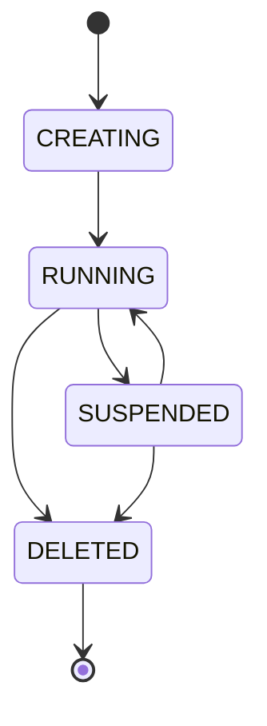

# Backend CrudCloud

## Descripción General

**CrudCloud Backend** es una plataforma basada en Spring Boot que permite a usuarios individuales y organizaciones crear, gestionar y acceder a instancias reales de bases de datos ejecutándose como contenedores Docker en una VPS.

## Características Principales

- 🔐 **Autenticación JWT** - Sistema de autenticación seguro con tokens
- 🐳 **Orquestación Docker** - Gestión automatizada de contenedores de bases de datos
- 💳 **Integración Mercado Pago** - Sistema de pagos y suscripciones
- 📊 **Multi-Motor** - Soporte para 6 motores de bases de datos
- 🔑 **Gestión de Credenciales** - Generación segura y rotación de contraseñas
- 📧 **Notificaciones** - Sistema de emails y generación de PDFs
- 🎯 **Planes y Límites** - Sistema de suscripciones con límites configurables

## Stack Tecnológico

- **Java 17+** con Spring Boot 3.x
- **Spring Data JPA** + Hibernate
- **Spring Security** con JWT
- **Docker Java SDK** para orquestación de contenedores
- **PostgreSQL** como base de datos principal
- **Mercado Pago SDK** para pagos
- **JavaMail** para notificaciones
- **iText/Apache PDFBox** para generación de PDFs

## Arquitectura

El backend sigue una arquitectura de **monolito modular** preparado para evolucionar a microservicios:

### Módulos Principales

1. **Auth Module** - Autenticación y gestión de usuarios
2. **Instance Module** - Provisioning y lifecycle de instancias
3. **Payment Module** - Procesamiento de transacciones
4. **Plan Module** - Gestión de suscripciones y límites
5. **Catalog Module** - Catálogo de motores de bases de datos
6. **Core Module** - Infraestructura compartida

## Motores de Bases de Datos Soportados

| Motor | Puerto | Estado |
|-------|--------|--------|
| MySQL | 3306 | ✅ Disponible |
| PostgreSQL | 5432 | ✅ Disponible |
| MongoDB | 27017 | ✅ Disponible |
| Redis | 6379 | ✅ Disponible |
| Cassandra | 9042 | ✅ Disponible |
| SQL Server | 1433 | ✅ Disponible |

## Estados de Instancias

## Próximos Pasos

- [Instalación y Configuración](./setup.md)
- [Arquitectura Detallada](./architecture.md)
- [Referencia de API](./api-reference.md)
- [Deployment](./deployment.md)
