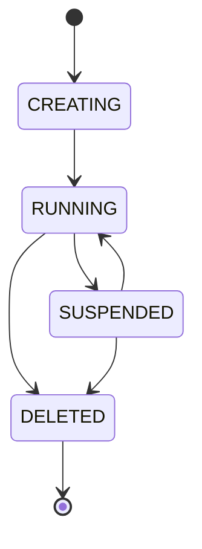

# CrudCloud Backend

## Overview

**CrudCloud Backend** is a Spring Boot-based platform that allows individual users and organizations to create, manage, and access real database instances running as Docker containers on a VPS.

## Main Features

- 🔐 **JWT Authentication** - Secure authentication system with tokens
- 🐳 **Docker Orchestration** - Automated management of database containers
- 💳 **Mercado Pago Integration** - Payment and subscription system
- 📊 **Multi-Engine** - Support for 6 database engines
- 🔑 **Credentials Management** - Secure generation and password rotation
- 📧 **Notifications** - Email system and PDF generation
- 🎯 **Plans and Limits** - Subscription system with configurable limits

## Tech Stack

- **Java 17+** with Spring Boot 3.x
- **Spring Data JPA** + Hibernate
- **Spring Security** with JWT
- **Docker Java SDK** for container orchestration
- **PostgreSQL** as main database
- **Mercado Pago SDK** for payments
- **JavaMail** for notifications
- **iText/Apache PDFBox** for PDF generation

## Architecture

The backend follows a **modular monolith** architecture prepared to evolve into microservices:

### Main Modules

1. **Auth Module** - Authentication and user management
2. **Instance Module** - Provisioning and lifecycle of instances
3. **Payment Module** - Transaction processing
4. **Plan Module** - Subscription and limits management
5. **Catalog Module** - Database engine catalog
6. **Core Module** - Shared infrastructure

## Supported Database Engines

| Engine | Port | Status |
|--------|------|--------|
| MySQL | 3306 | ✅ Available |
| PostgreSQL | 5432 | ✅ Available |
| MongoDB | 27017 | ✅ Available |
| Redis | 6379 | ✅ Available |
| Cassandra | 9042 | ✅ Available |
| SQL Server | 1433 | ✅ Available |

## Instance States

## Next Steps

- [Installation and Configuration](./setup.md)
- [Detailed Architecture](./architecture.md)
- [API Reference](./api-reference.md)
- [Deployment](./deployment.md)
