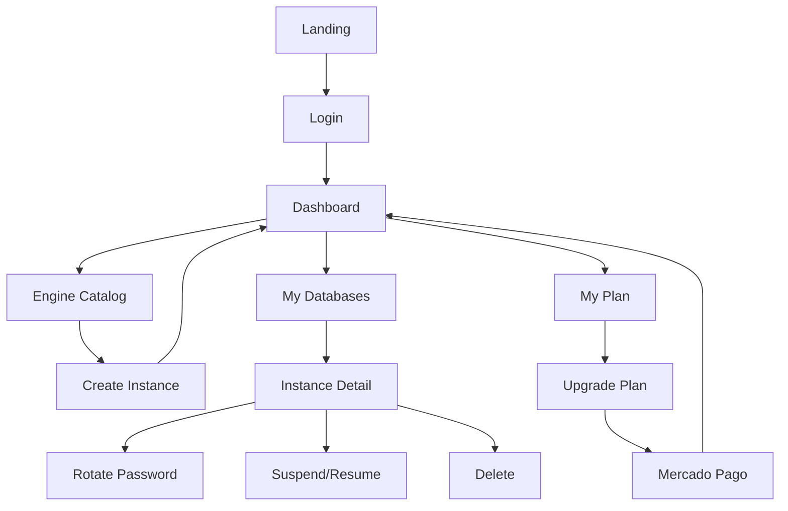

# CrudCloud Frontend

## General Description

Modern dashboard built with React 18 and TailwindCSS to manage cloud databases intuitively and efficiently.

## Tech Stack

| Technology | Version | Purpose |
|------------|---------|-----------|
| **React** | 18 | Main UI library |
| **React Router** | v6 | Navigation and routing |
| **Vite** | Latest | Build tool and dev server |
| **TailwindCSS** | Latest | Styling framework |
| **Axios** | Latest | HTTP client |
| **Lucide React** | Latest | Icon system |
| **Zustand** | Latest | State management |

## Main Features

### 🔐 Authentication
- Login and registration with JWT
- Persistent session management
- Private route protection

### 📊 Dashboard
- Overview of usage and statistics
- Current plan indicators
- Real-time metrics

### 🗄️ Database Management
- Catalog of available engines
- Instance creation with validation
- Instance listing and search
- Detailed view with credentials

### 🔑 Credential Management
- Copy-to-clipboard for credentials
- Password rotation
- PDF download with information
- Controlled password visibility

### 💳 Plans and Payments
- Plan comparison
- Upgrade with Mercado Pago
- Usage and limit indicators

### 🎨 UI/UX
- 📱 Responsive design (mobile-first)
- 🌙 Dark mode ready
- ♿ Accessibility (ARIA labels)
- 🎯 Reusable components

## Screenshots

### Dashboard
*(Main view with statistics and quick access)*

### Engine Catalog
*(Grid of available engines: MySQL, PostgreSQL, MongoDB, etc.)*

### My Databases
*(Instance listing with states and actions)*

### Instance Detail
*(Credentials, connection and management options)*

## Component Architecture

```
src/
├── components/
│   ├── common/          # Reusable components
│   │   ├── Button.jsx
│   │   ├── Input.jsx
│   │   ├── Modal.jsx
│   │   ├── Card.jsx
│   │   ├── Toast.jsx
│   │   ├── Badge.jsx
│   │   └── Select.jsx
│   └── layout/          # Layout components
│       ├── Sidebar.jsx
│       ├── Navbar.jsx
│       ├── LayoutDashboard.jsx
│       └── navItems.js
├── pages/               # Main pages
│   ├── LoginPage.jsx
│   ├── Dashboard.jsx
│   ├── AvailableEngines.jsx
│   ├── MyDatabases.jsx
│   ├── DatabaseDetail.jsx
│   └── MyPlan.jsx
├── context/             # React Context
│   └── AuthContext.jsx
├── utils/               # Utilities
│   ├── api.js          # Axios client
│   └── helpers.js      # Helper functions
├── types/               # Constants and types
│   └── constants.js
├── styles/              # Global styles
│   └── globals.css
├── App.jsx              # Root component
└── main.jsx            # Entry point
```

## Navigation Flow



## Color Palette

```css
:root {
  --primary: #6366F1;      /* Indigo-500 */
  --success: #16A34A;      /* Green-600 */
  --error: #DC2626;        /* Red-600 */
  --warning: #EA580C;      /* Orange-600 */
  --background: #FAFAF9;   /* Stone-50 */
  --text: #1C1917;         /* Stone-900 */
  --text-muted: #78716C;   /* Stone-500 */
}
```

## API Integration

The frontend connects to the backend via Axios configured with:

- **Base URL:** Configurable via `VITE_API_URL`
- **Interceptors:** Automatic JWT injection
- **Error Handling:** Global HTTP error handling
- **Retry Logic:** Retries on network failures

### Configuration Example

```javascript
// src/utils/api.js
import axios from 'axios';

const api = axios.create({
  baseURL: import.meta.env.VITE_API_URL || 'http://localhost:8080/api',
  headers: {
    'Content-Type': 'application/json',
  },
});

// Interceptor for JWT
api.interceptors.request.use((config) => {
  const token = localStorage.getItem('token');
  if (token) {
    config.headers.Authorization = `Bearer ${token}`;
  }
  return config;
});

export default api;
```

## State Management

### AuthContext

Manages global authentication:
- Current user
- JWT token
- Login/Logout
- Persistence in localStorage

### Local State

Each component manages its local state with `useState` for:
- Forms
- Loading states
- Validation errors

### Zustand (optional)

For more complex state:
- Data cache
- Shared state between unrelated components

## Next Steps

- [Installation and Setup](./setup.md)
- [Components](./components.md)
- [Deployment](./deployment.md)
