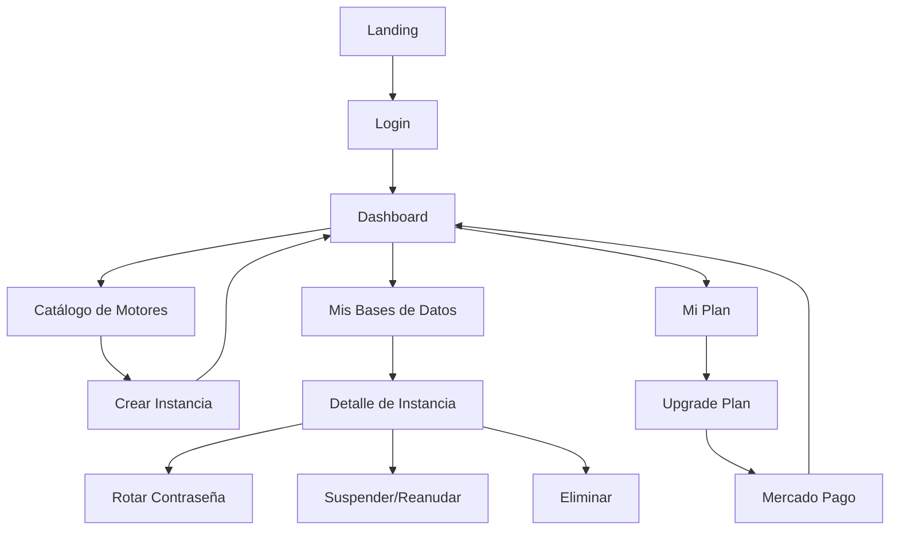

# Frontend CrudCloud

## Descripción General

Dashboard moderno construido con React 18 y TailwindCSS para gestionar bases de datos en la nube de forma intuitiva y eficiente.

## Tech Stack

| Tecnología | Versión | Propósito |
|------------|---------|-----------|
| **React** | 18 | Librería UI principal |
| **React Router** | v6 | Navegación y routing |
| **Vite** | Latest | Build tool y dev server |
| **TailwindCSS** | Latest | Framework de estilos |
| **Axios** | Latest | Cliente HTTP |
| **Lucide React** | Latest | Sistema de iconos |
| **Zustand** | Latest | Gestión de estado |

## Características Principales

### 🔐 Autenticación
- Login y registro con JWT
- Gestión de sesiones persistente
- Protección de rutas privadas

### 📊 Dashboard
- Vista general de uso y estadísticas
- Indicadores de plan actual
- Métricas en tiempo real

### 🗄️ Gestión de Bases de Datos
- Catálogo de motores disponibles
- Creación de instancias con validación
- Listado y búsqueda de instancias
- Vista detallada con credenciales

### 🔑 Gestión de Credenciales
- Copy-to-clipboard para credenciales
- Rotación de contraseñas
- Descarga de PDF con información
- Visibilidad controlada de contraseñas

### 💳 Planes y Pagos
- Comparación de planes
- Upgrade con Mercado Pago
- Indicadores de uso y límites

### 🎨 UI/UX
- 📱 Diseño responsive (mobile-first)
- 🌙 Dark mode listo
- ♿ Accesibilidad (ARIA labels)
- 🎯 Componentes reutilizables

## Capturas de Pantalla

### Dashboard
*(Vista principal con estadísticas y accesos rápidos)*

### Catálogo de Motores
*(Grid de motores disponibles: MySQL, PostgreSQL, MongoDB, etc.)*

### Mis Bases de Datos
*(Listado de instancias con estados y acciones)*

### Detalle de Instancia
*(Credenciales, conexión y opciones de gestión)*

## Arquitectura de Componentes

```
src/
├── components/
│   ├── common/          # Componentes reutilizables
│   │   ├── Button.jsx
│   │   ├── Input.jsx
│   │   ├── Modal.jsx
│   │   ├── Card.jsx
│   │   ├── Toast.jsx
│   │   ├── Badge.jsx
│   │   └── Select.jsx
│   └── layout/          # Componentes de layout
│       ├── Sidebar.jsx
│       ├── Navbar.jsx
│       ├── LayoutDashboard.jsx
│       └── navItems.js
├── pages/               # Páginas principales
│   ├── LoginPage.jsx
│   ├── Dashboard.jsx
│   ├── AvailableEngines.jsx
│   ├── MyDatabases.jsx
│   ├── DatabaseDetail.jsx
│   └── MyPlan.jsx
├── context/             # React Context
│   └── AuthContext.jsx
├── utils/               # Utilidades
│   ├── api.js          # Cliente Axios
│   └── helpers.js      # Funciones auxiliares
├── types/               # Constantes y tipos
│   └── constants.js
├── styles/              # Estilos globales
│   └── globals.css
├── App.jsx              # Componente raíz
└── main.jsx            # Entry point
```

## Flujo de Navegación



## Paleta de Colores

```css
:root {
  --primary: #6366F1;      /* Indigo-500 */
  --success: #16A34A;      /* Green-600 */
  --error: #DC2626;        /* Red-600 */
  --warning: #EA580C;      /* Orange-600 */
  --background: #FAFAF9;   /* Stone-50 */
  --text: #1C1917;         /* Stone-900 */
  --text-muted: #78716C;   /* Stone-500 */
}
```

## Integración con API

El frontend se conecta al backend mediante Axios configurado con:

- **Base URL:** Configurable via `VITE_API_URL`
- **Interceptores:** Inyección automática de JWT
- **Error Handling:** Manejo global de errores HTTP
- **Retry Logic:** Reintentos en fallos de red

### Ejemplo de Configuración

```javascript
// src/utils/api.js
import axios from 'axios';

const api = axios.create({
  baseURL: import.meta.env.VITE_API_URL || 'http://localhost:8080/api',
  headers: {
    'Content-Type': 'application/json',
  },
});

// Interceptor para JWT
api.interceptors.request.use((config) => {
  const token = localStorage.getItem('token');
  if (token) {
    config.headers.Authorization = `Bearer ${token}`;
  }
  return config;
});

export default api;
```

## Gestión de Estado

### AuthContext

Maneja la autenticación global:
- Usuario actual
- Token JWT
- Login/Logout
- Persistencia en localStorage

### Local State

Cada componente gestiona su estado local con `useState` para:
- Formularios
- Loading states
- Errores de validación

### Zustand (opcional)

Para estado más complejo:
- Cache de datos
- Estado compartido entre componentes no relacionados

## Próximos Pasos

- [Instalación y Setup](./setup.md)
- [Estructura del Proyecto](./project-structure.md)
- [Componentes](./components.md)
- [Deployment](./deployment.md)
