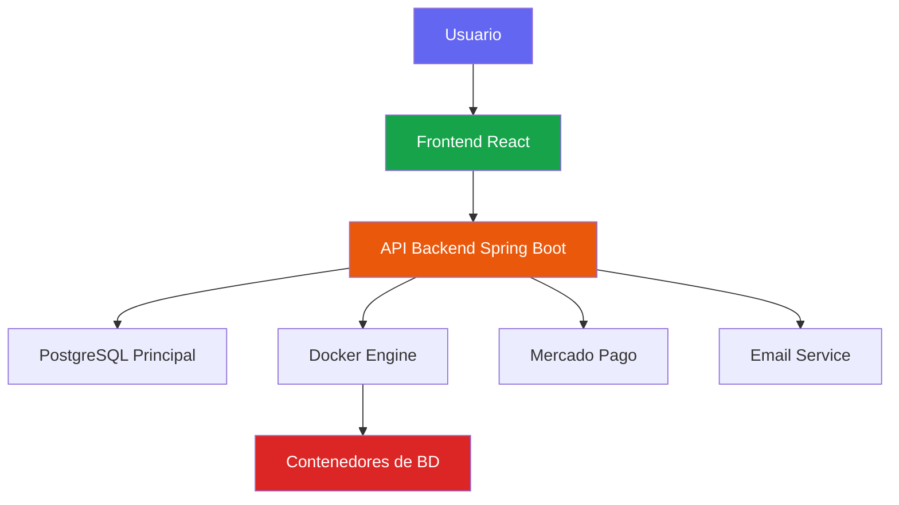
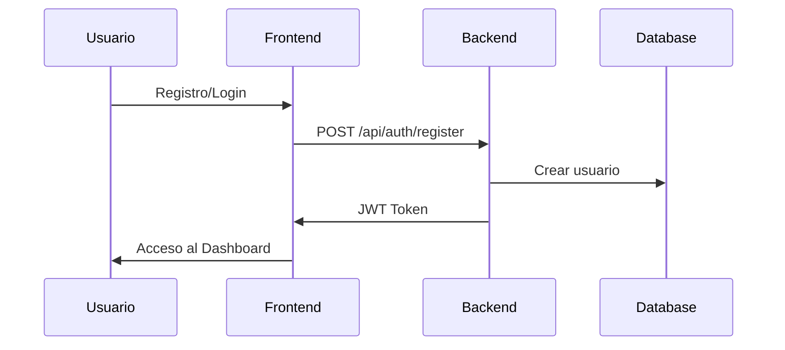
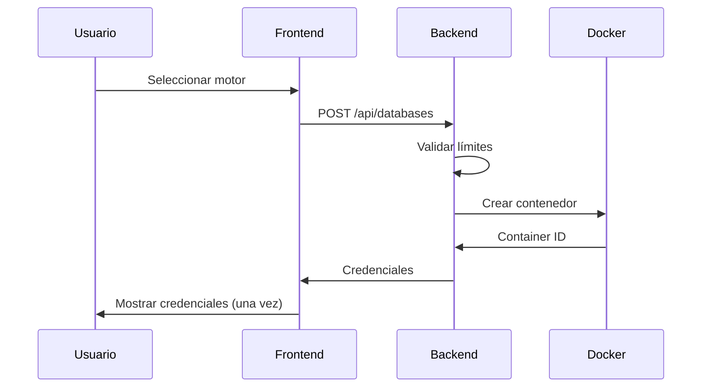

# Bienvenido a CrudCloud

**CrudCloud** es una plataforma cloud que permite a individuos y organizaciones crear, gestionar y acceder a instancias reales de bases de datos ejecutándose como contenedores Docker en una VPS.

## ¿Qué es CrudCloud?

CrudCloud simplifica el proceso de provisioning de bases de datos, eliminando la complejidad de la configuración manual. Con unos pocos clics, puedes:

- 🚀 Crear instancias de bases de datos en segundos
- 🔐 Obtener credenciales seguras automáticamente
- 🎯 Gestionar el ciclo de vida completo (crear, suspender, reanudar, eliminar)
- 💳 Escalar con planes flexibles y pagos integrados
- 📊 Monitorear el uso y los límites de tu plan

## Motores de Bases de Datos Soportados

| Motor | Versión | Tipo | Puerto |
|-------|---------|------|--------|
| **MySQL** | 8.0 | Relacional | 3306 |
| **PostgreSQL** | 14 | Relacional | 5432 |
| **MongoDB** | 6.0 | NoSQL (Documentos) | 27017 |
| **Redis** | 7.0 | Key-Value (In-Memory) | 6379 |
| **Cassandra** | 4.1 | NoSQL (Columnar) | 9042 |
| **SQL Server** | 2022 | Relacional | 1433 |

## Arquitectura de la Plataforma

## Stack Tecnológico

### Backend
- **Java 17+** con Spring Boot 3.x
- **Spring Data JPA** + Hibernate
- **Spring Security** con JWT
- **Docker Java SDK** para orquestación
- **PostgreSQL** como base de datos principal
- **Mercado Pago SDK** para pagos

### Frontend
- **React 18** con Vite
- **React Router v6** para navegación
- **TailwindCSS** para estilos
- **Axios** para comunicación HTTP
- **Zustand** para gestión de estado

### Infraestructura
- **Docker** y Docker Compose
- **Nginx** como reverse proxy
- **VPS** con Ubuntu
- **SSL** con Let's Encrypt

## Planes y Precios

| Plan | Instancias | Precio | Características |
|------|-----------|--------|-----------------|
| **FREE** | 2 | $0/mes | Nombres de BD auto-generados, Soporte comunitario |
| **STANDARD** | 5 | $19.99/mes | Nombres personalizados, Soporte por email, Backups diarios |
| **PREMIUM** | 10 | $49.99/mes | Todo lo de STANDARD + Soporte prioritario, Backups por hora |

## Flujo de Trabajo

### 1. Registro y Autenticación

### 2. Crear Instancia

### 3. Gestionar Instancia
- **Suspender:** Detiene el contenedor (libera recursos)
- **Reanudar:** Inicia el contenedor nuevamente
- **Rotar Contraseña:** Genera nueva contraseña segura
- **Eliminar:** Destruye el contenedor permanentemente

## Comenzar

Explora la documentación por sección:

### 📚 [Backend](./backend/intro.md)
- Instalación y configuración
- Arquitectura del sistema
- Referencia de API REST
- Deployment en producción

### 🎨 [Frontend](./frontend/intro.md)
- Setup del proyecto
- Estructura de componentes
- Integración con API
- Deployment con Docker

### 🎓 [Tutoriales](./tutorial-basics/create-a-document.md)
- Crear documentación
- Personalizar el sitio
- Deploy de Docusaurus

## Características Destacadas

### 🔐 Seguridad
- Autenticación JWT con tokens
- Contraseñas hasheadas con BCrypt
- Visibilidad única de credenciales
- Rotación de contraseñas
- HTTPS obligatorio

### 🐳 Orquestación Docker
- Creación automática de contenedores
- Gestión de puertos dinámicos
- Health checks automatizados
- Cleanup de recursos

### 💳 Pagos Integrados
- Integración con Mercado Pago
- Sandbox para testing
- Webhooks para confirmación
- Actualización automática de planes

### 📧 Notificaciones
- Emails de bienvenida
- Confirmación de creación de instancias
- Alertas de rotación de contraseñas
- PDFs con credenciales descargables

## Recursos Adicionales

- 🔗 **Backend Repository:** [CrudCloud-Backend-ColdBrew](https://github.com/Team-Cold-Brew/CrudCloud-Backend-ColdBrew)
- 🔗 **Frontend Repository:** [CrudCloud-Frontend](https://github.com/Team-Cold-Brew/CrudCloud-Frontend)
- 🌐 **Sitio Web:** [https://cold-brew.crudzaso.com](https://cold-brew.crudzaso.com)
- 📊 **Azure Boards:** Trazabilidad de desarrollo

## Soporte

¿Necesitas ayuda?

- 📖 Lee la documentación completa
- 💬 Abre un issue en GitHub
- 📧 Contacta al equipo: Team Cold Brew

---

**¡Empieza ahora y despliega tu primera base de datos en minutos!** 🚀
