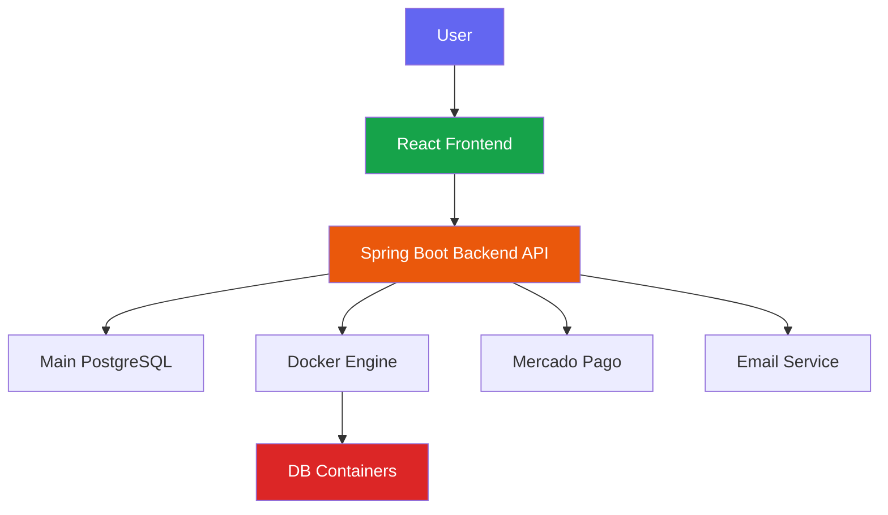
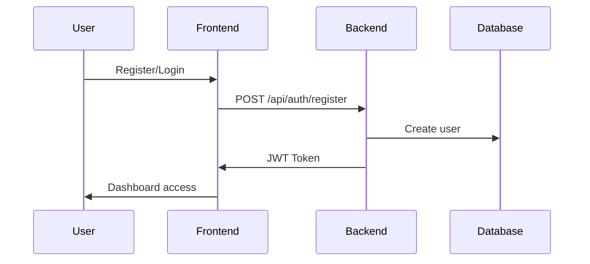
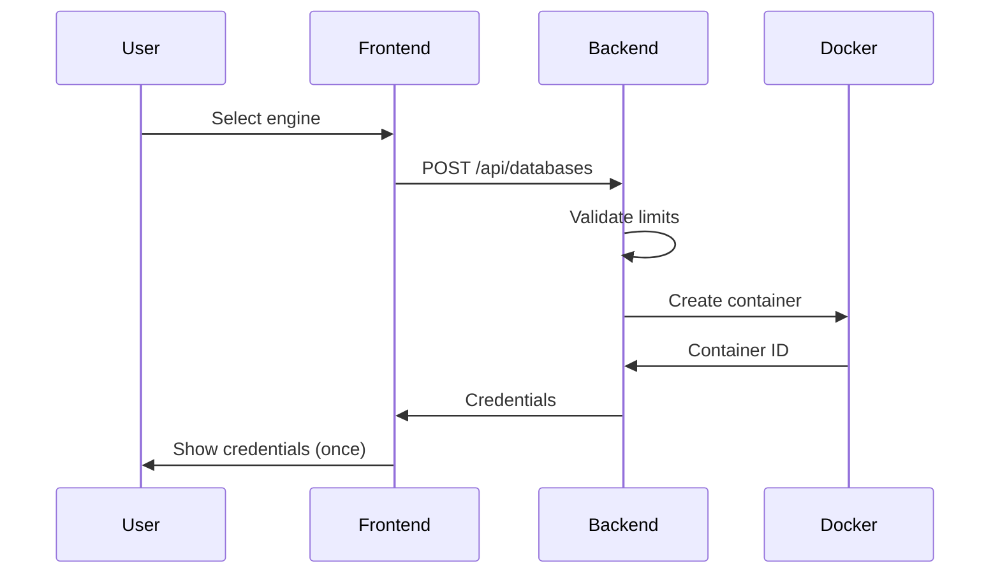

# Welcome to CrudCloud

**CrudCloud** is a cloud platform that allows individuals and organizations to create, manage, and access real database instances running as Docker containers on a VPS.

## What is CrudCloud?

CrudCloud simplifies the database provisioning process, eliminating the complexity of manual configuration. With just a few clicks, you can:

- 🚀 Create database instances in seconds
- 🔐 Get secure credentials automatically
- 🎯 Manage the complete lifecycle (create, suspend, resume, delete)
- 💳 Scale with flexible plans and integrated payments
- 📊 Monitor usage and limits of your plan

## Supported Database Engines

| Engine | Version | Type | Port |
|--------|---------|------|------|
| **MySQL** | 8.0 | Relational | 3306 |
| **PostgreSQL** | 14 | Relational | 5432 |
| **MongoDB** | 6.0 | NoSQL (Documents) | 27017 |
| **Redis** | 7.0 | Key-Value (In-Memory) | 6379 |
| **Cassandra** | 4.1 | NoSQL (Columnar) | 9042 |
| **SQL Server** | 2022 | Relational | 1433 |

## Platform Architecture

## Tech Stack

### Backend
- **Java 17+** with Spring Boot 3.x
- **Spring Data JPA** + Hibernate
- **Spring Security** with JWT
- **Docker Java SDK** for orchestration
- **PostgreSQL** as main database
- **Mercado Pago SDK** for payments

### Frontend
- **React 18** with Vite
- **React Router v6** for navigation
- **TailwindCSS** for styling
- **Axios** for HTTP communication
- **Zustand** for state management

### Infrastructure
- **Docker** and Docker Compose
- **Nginx** as reverse proxy
- **VPS** with Ubuntu
- **SSL** with Let's Encrypt

## Plans and Pricing

| Plan | Instances | Price | Features |
|------|-----------|-------|----------|
| **FREE** | 2 | $0/month | Auto-generated DB names, Community support |
| **STANDARD** | 5 | $19.99/month | Custom names, Email support, Daily backups |
| **PREMIUM** | 10 | $49.99/month | All STANDARD + Priority support, Hourly backups |

## Workflow

### 1. Registration and Authentication

### 2. Create Instance

### 3. Manage Instance
- **Suspend:** Stops the container (frees resources)
- **Resume:** Starts the container again
- **Rotate Password:** Generates new secure password
- **Delete:** Permanently destroys the container

## Getting StartedStarted

Explore the documentation by section:

### 📚 [Backend](./backend/intro.md)
- Installation and configuration
- System architecture
- REST API reference
- Production deployment

### 🎨 [Frontend](./frontend/intro.md)
- Project setup
- Component structure
- API integration
- Docker deployment

## Featured Characteristics

### 🔐 Security
- JWT token authentication
- BCrypt hashed passwords
- Single-view credentials visibility
- Password rotation
- Mandatory HTTPS

### 🐳 Docker Orchestration
- Automatic container creation
- Dynamic port management
- Automated health checks
- Resource cleanup

### 💳 Integrated Payments
- Mercado Pago integration
- Sandbox for testing
- Webhooks for confirmation
- Automatic plan updates

### 📧 Notifications
- Welcome emails
- Instance creation confirmation
- Password rotation alerts
- Downloadable credential PDFs

## Additional Resources

- 🔗 **Backend Repository:** [CrudCloud-Backend-ColdBrew](https://github.com/Team-Cold-Brew/CrudCloud-Backend-ColdBrew)
- 🔗 **Frontend Repository:** [CrudCloud-Frontend](https://github.com/Team-Cold-Brew/CrudCloud-Frontend)
- 🌐 **Website:** [https://cold-brew.crudzaso.com](https://cold-brew.crudzaso.com)
- 📊 **Azure Boards:** Development traceability

## Support

Need help?

- 📖 Read the complete documentation
- 💬 Open an issue on GitHub
- 📧 Contact the team: Team Cold Brew

---

**Start now and deploy your first database in minutes!** 🚀
